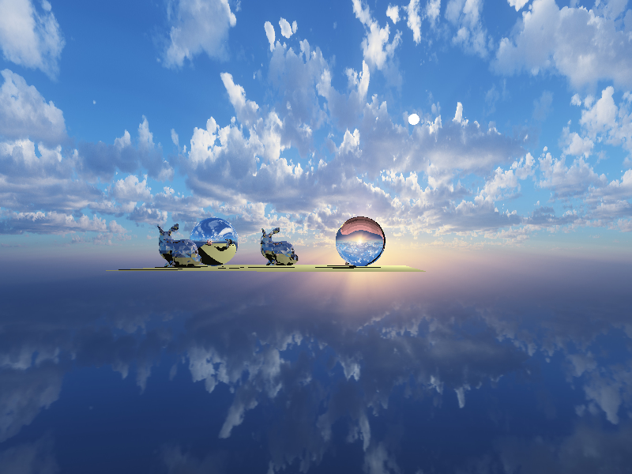
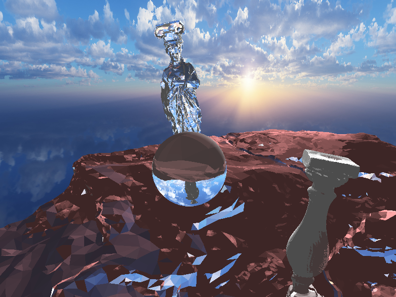

# kobra

Kobra is a Vulkan 3D rendering engine with the purpose of providing a handful of
styles of rendering and tools to ease the developement of game and interactive
3D software.

# Rendering styles

## Ray tracing

Ray tracing is done with compute shaders on the GPU, using modern acceleration
structures like BVHs to create an optimized pipeline for almost realtime
raytracing. This is possible through the flexibility of Vulkan.

# Goals

Specialized rendering styles:

- [ ] Rasterization
- [ ] Path tracing
- [ ] Non-photorealistic rendering (.i.e. cross hatching)

Tools:

- [ ] 3D scene reconstruction (from a set of images)
- [ ] 3D terrain generation
