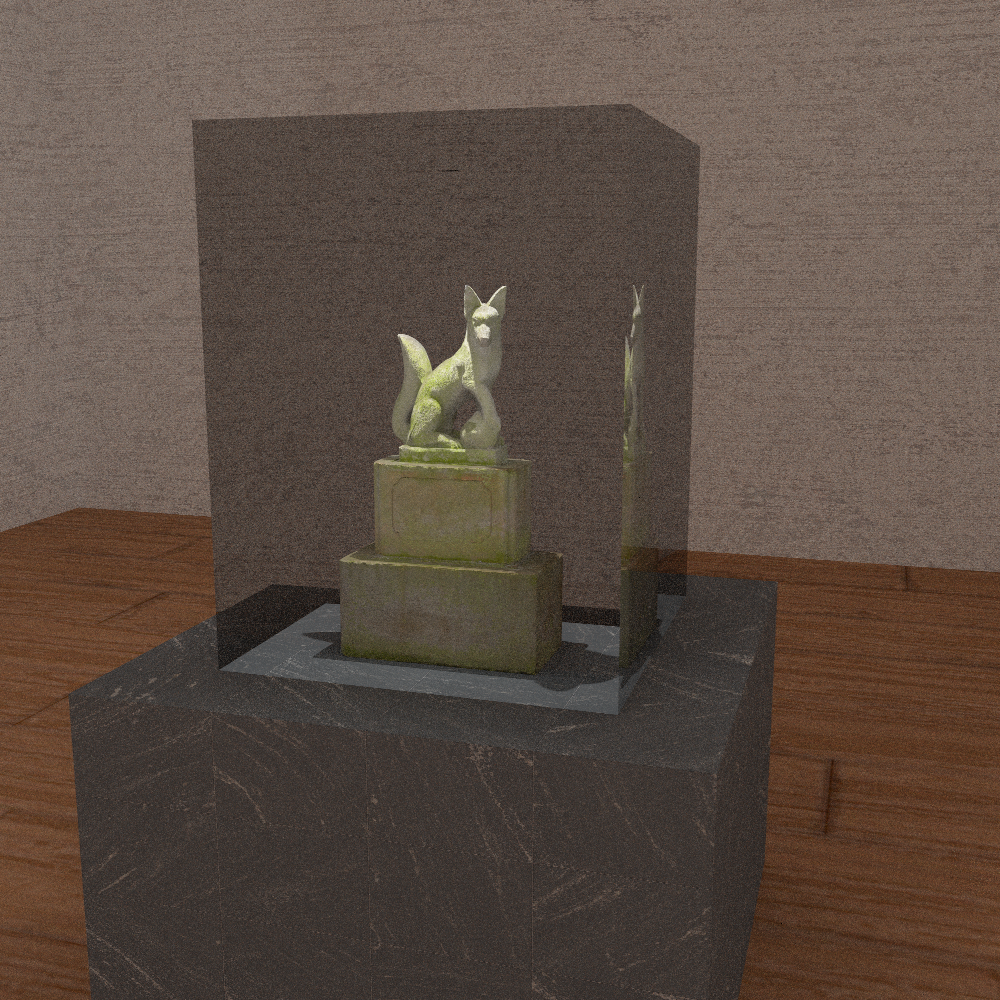
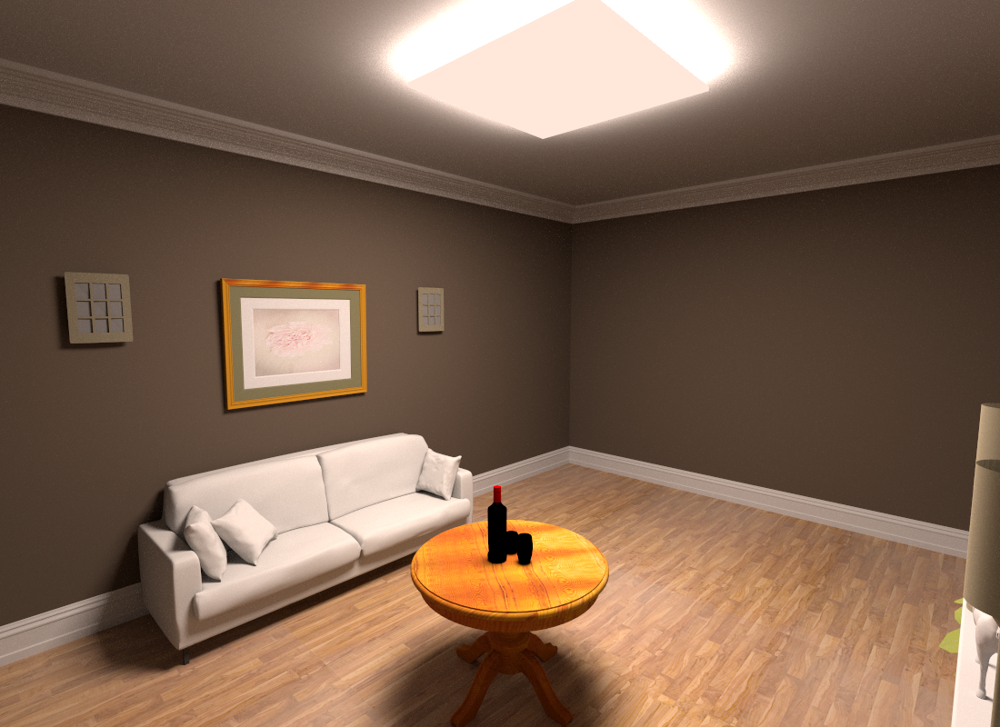
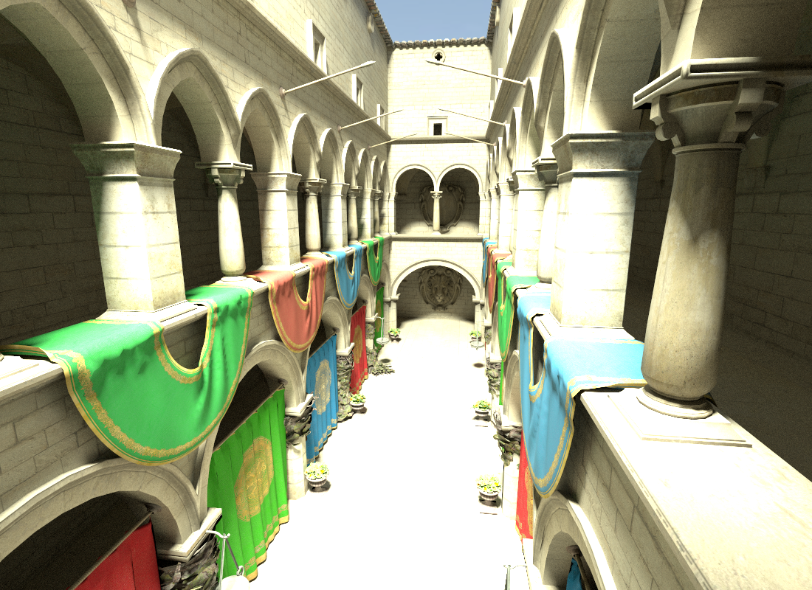
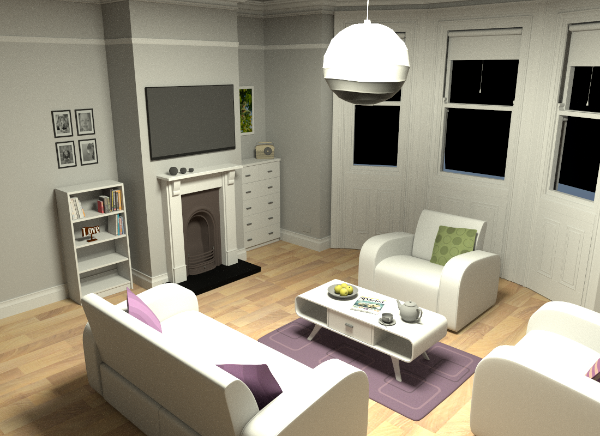
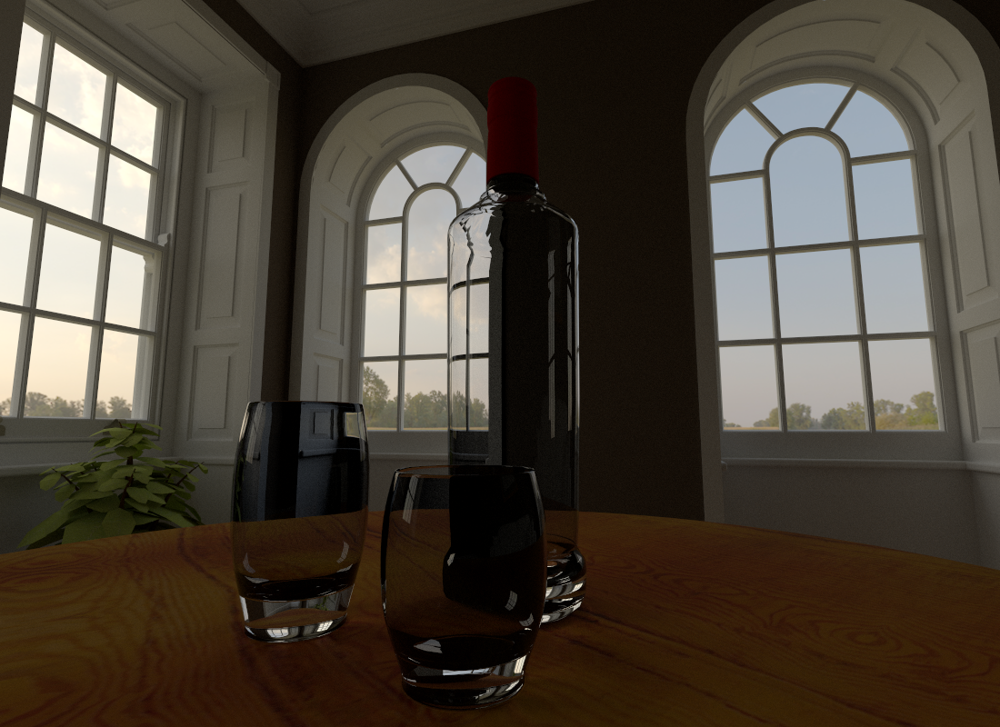

# Kobra

Kobra is a 3D vulkan rendering engine written in C++. It's modular interface is
designed to yield a robust yet flexible framework with which one can efficiently
experiment with new rendering techniques. Thus, it presents itself as an easy
to learn basis for research in visual computing.

## Features

The primary focus of Kobra has been physically based rendering. The following
are notable features in this regard:

- [x] Path tracing in GLSL
	- [x] Construction and traversal of modern acceleration structures (BVHs)
	- [x] Multiple importance sampling with GGX microfacet BRDFs
- [x] Path tracing with NVIDIA OptiX
	- [x] Multiple importance sampling with GGX microfacet BRDFs
	- [x] Tranmission through dielectrics
	- [x] OptiX AI denoising (AOV)

Furthermore, Kobra provides the ability to perform classical rasterization and
UI rendering.

Kobra aims to be part of the leading edge of rendering technology. In the
future, Kobra aims to ease the process of building large scenes and assets with
affordable resources. Algorithms of interest are 3D scene reconstruction,
material inference from images, and creating character animations from video
samples.

## Screenshots

The following scenes are from the McGuire Computer Graphics Archive. There were
rendered on a RTX 3060 Ti using the OptiX path tracer. All scenes achieved
reasonable performance, averaging at least 30 frames per second.

	<h3> Breakfast Room </h3>
	

		
	

	<b>Figure 1:</b> Basic indoor scene, demonstrating soft shadows and crisp textures.

 

	<h3> Fireplace (Indoor Lighting) </h3>
	

		
	

	<b>Figure 2:</b> Another indoor scene, this time with more glossy materials.

 

	<h3> Sponza </h3>
	

		
	

	<b>Figure 3:</b> A large outdoor scene, demonstrating lobal illumination.

 

	<h3> Living Room </h3>
	

		
	

	<b>Figure 4:</b> An indoor scene featuring lots of complex geometry and textures.

 

	<h3> Fireplace (Outdoor Lighting) </h3>
	

		
	

	<b>Figure 5:</b> This indoor scene involves no direct lighting, but is still
	lit by the environment map in background, which enters through the windows. 
	Also note the glass, which exhibits perfect specular transmission and
	reflection, much like real glass.

