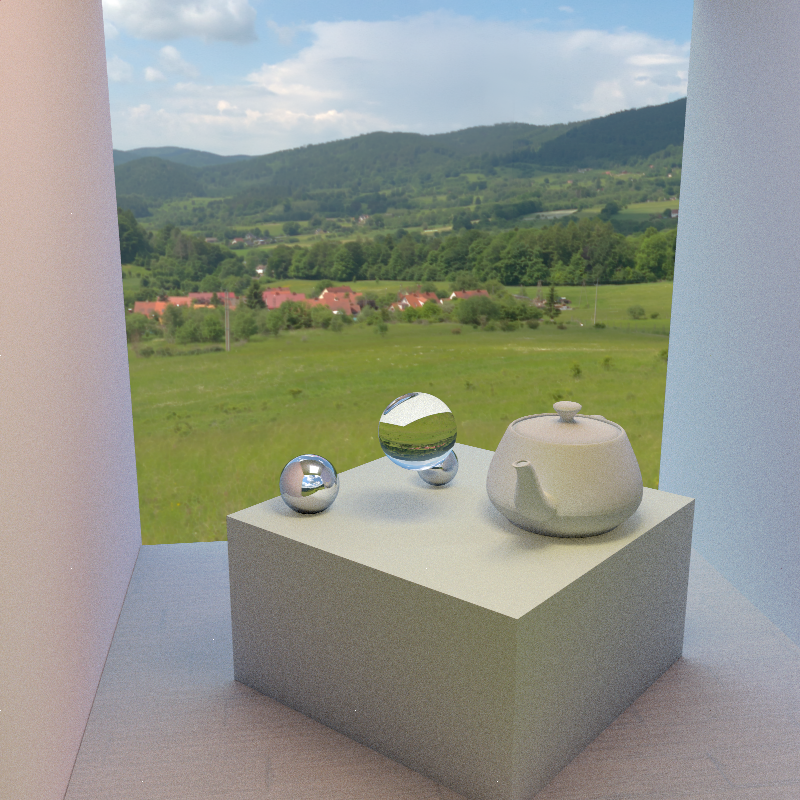
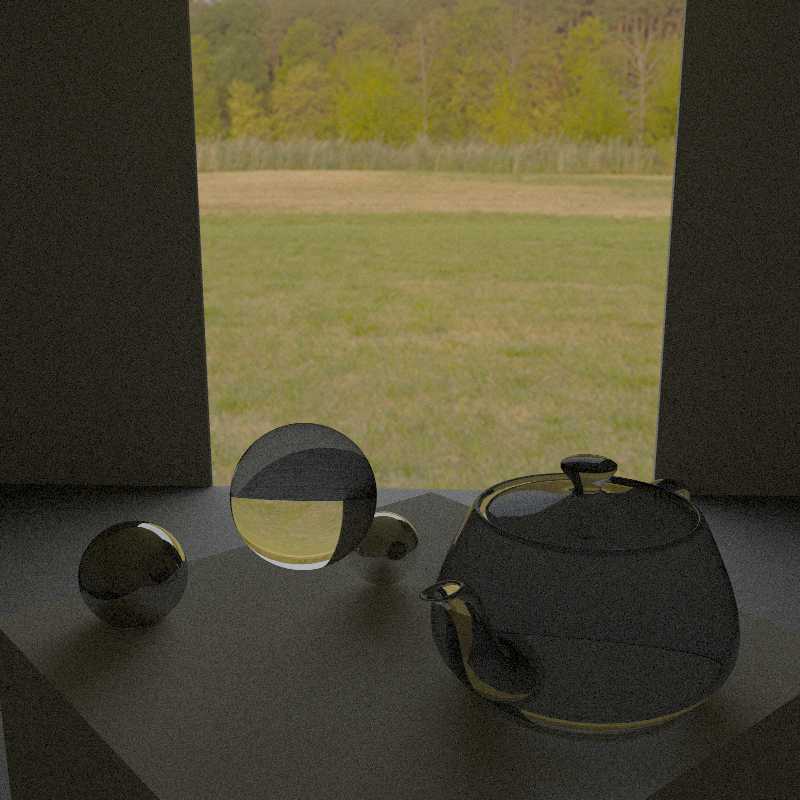

# Kobra

Kobra is a 3D rendering engine written in C++ using Vulkan. It is built to be a
very robust and generalizable framework with which one can easily experiment
with new and state of the art rendering techniques and style. Thus it is a
suitable foundation from which to begin research in visual computing.

## Features

The highlight of Kobra is its ray tracing capability. Using the flexibility of
the Vulkan API, a streamlined pipeline is created to perform ray tracing in
grid batches on the GPU. Modern acceleration structures (BVHs) are used to boost
the throughput of the GPU, and physically accurate bidirectional scattering (and
reflection) distributions are used to model the interactions of light with the
materials in the scene.

Kobra is also capable of traditional rasterization, with modern techniques like
depth buffering.

In the future, Kobra aims to ease the process of building large scenes and
assets with affordable resources. Algorithms of interest are 3D scene
reconstruction, material inference from images, and creating character
animations from video samples.

## Rendered Scenes

All these scenes were rendered (ray-traced) on a GTX 1660 Ti.

A demonstration of multiple importance sampling (MIS) with Monte Carlo path
tracing in a scene composed of diffuse and specular objects (both reflective and
tranmissive), lit with area lights and environment based lighting.

	

	<b>Figure 1:</b> Scene demonstrating the rendering of relatively basic materials with MIS path tracing (1 hour)

A similar scene (the teapot is now tranmissive as well), but most of the
lighting arrives onto the objects indirectly from the environment through the
glass pane (transmissive, in the middle).

	

	<b>Figure 2:</b> Scene lit mostly with indirect lighting (3 hours)

