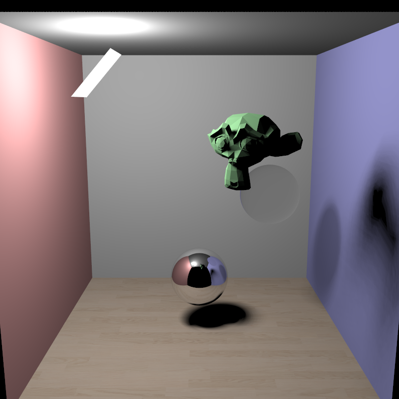
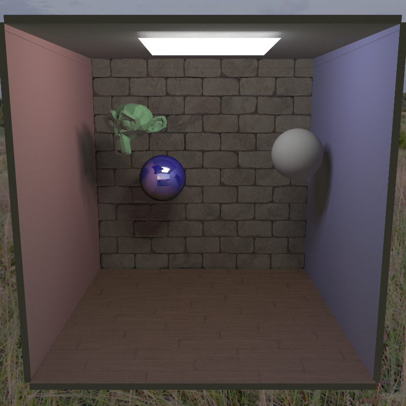
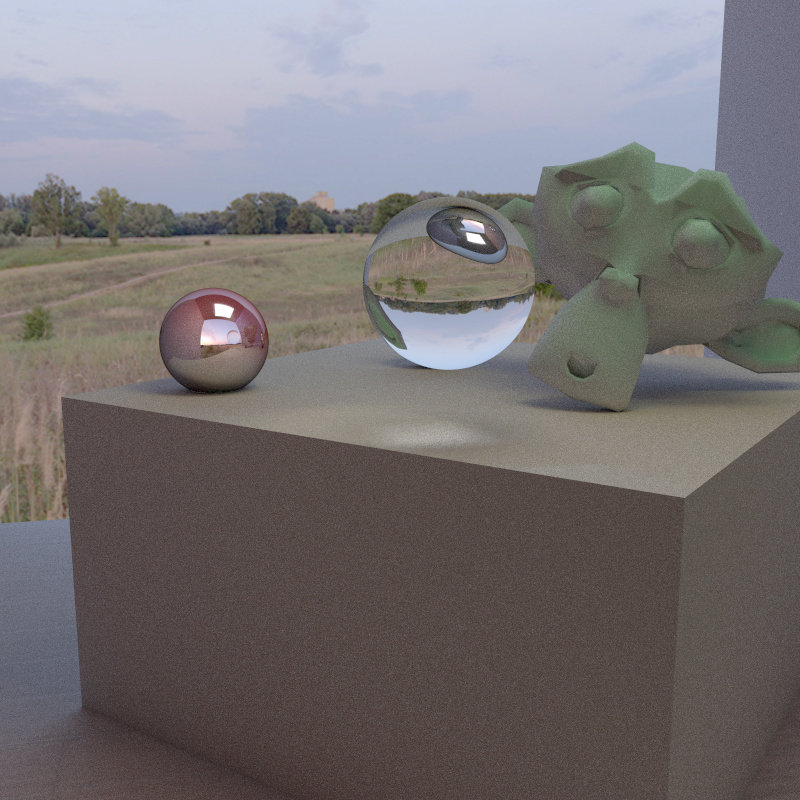

# Kobra

Kobra is a 3D rendering engine written in C++ using Vulkan. It is built to be a
very robust and generalizable framework with which one can easily experiment
with new and state of the art rendering techniques and style. Thus it is a
suitable foundation from which to begin research in visual computing.

Kobra is capable of traditional rasterization, with modern techniques like depth
buffering. It can also perform raytracing in realtime; this is done using the
flexibility of Vulkan's API to create a streamlined pipeline to perform ray
calculations for each pixel on the GPU. It uses modern acceleration structures
like the BVH and incorperates the physical behaviour of light to produce
photorealistic images.

In the future, Kobra aims to ease the process of building large scenes and
assets with affordable resources. Algorithms of interest are 3D scene
reconstruction, material inference from images, and creating character
animations from video samples.

Below are a few scenes that Kobra can currently render. The hardware used is a
GTX 1660 Ti.

Path traced with 16 samples per pixel and 1000 shadow samples in around 30
minutes.

Path traced with 1024 samples per pixel and 16 shadow samples in around 2 hours
and 30 minutes.

Bidirectional path tracing with 100 samples per pixel and 32 shadow samples in
around an hour.
