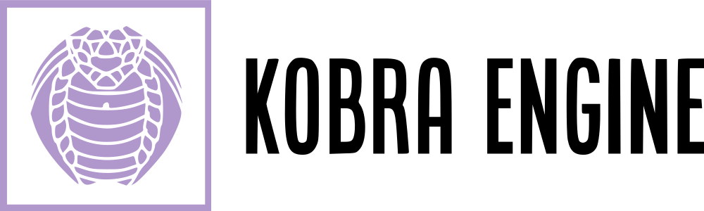
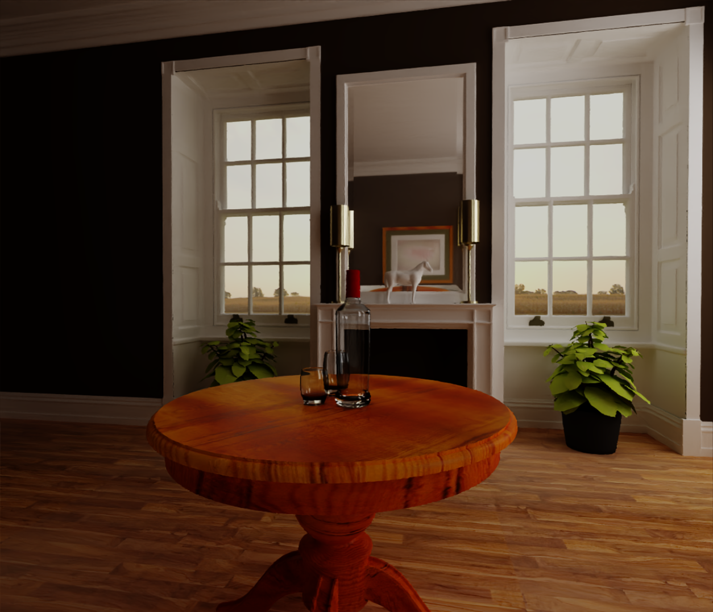

# Kobra

Kobra is a 3D rendering engine written in C++ using the Vulkan API. It is
designed with research development in mind, so that more time can be spent
towards experimentation rather than implementation. This project is still in
progress.

## Current Features

Kobra targets physically-based path-tracing pipelines. Currently, only
path-tracing with OptiX/CUDA is supported (see the **Upcoming** section
for platforms that will be supported in the future).

However, Kobra provides other facilities that enables convenient development of
rendering applications, such as rasterization (with customizable shader
programs) and UI rendering (currently built directly off of ImGui).

These facilities can be accessed as *layers*; for example, `ForwardRenderer`,
`UI`, and `Denoiser` are layers which perform computations related to forward
rendering, UI rendering, and image denoising. Multiple layers can be
sequentially dispatched in the same command buffer. The documentation for such
operations are still in development.

Furthermore, Kobra provides an (basic) interface for editing scenes and
rendering, shown below:

Note that this is not final by any means, and any suggestions for improving this
interface are welcome.

Scenes are currently specified with a file describing components in
the entity-component system; see `scenes/` for examples. The file specification
for scenes is not fixed, and still being developed.

### Layers

The following list includes the currently available layers.

- `MeshMemory`: manages mesh memory, which is often shared across other layers
- `ForwardRenderer`: performs forward rendering, with customizable `ShaderProgram`s
- `UI`: does UI rendering, by attaching user-defined `ImGuiAttachment` objects
- `Denoiser`: denoises input images
- `Framer`: renders a plain image to the swapchain; useful for raytracing, where
  the image is generated outside of Vulkan
- `System`: manages raytracing buffers and acceleration structures for a given
  scene
- `ArmadaRTX`: performs raytracing of arbitrary programs; the functionality of
  the RTX kernels can be programmed via `AttachmentRTX` objects -- see
  `path_tracer.cuh` and `restir.cuh` in the `include/armada/` directory for
  examples

## Renders

The following are example renders generated from Kobra's OptiX path tracer (+AI
denoising).

### Bathroom [1]

### Breakfast Room [1]

### Fireplace [1]

### Kitchen [2]

### Living Room [1]

### San Miguel [1]

### Sibenik [1]

[1] [McGuire Computer Graphics Archive](https://casual-effects.com/data/)

[2] [Rendering Resources](https://benedikt-bitterli.me/resources/)

# Upcoming

- [ ] Revive the GLSL path tracer (using RadeonRays as backend)
- [ ] VulkanRTX port
- [ ] Implement an applet for presenting image difference with various metrics
  (e.g. MAPE, FLIP)
