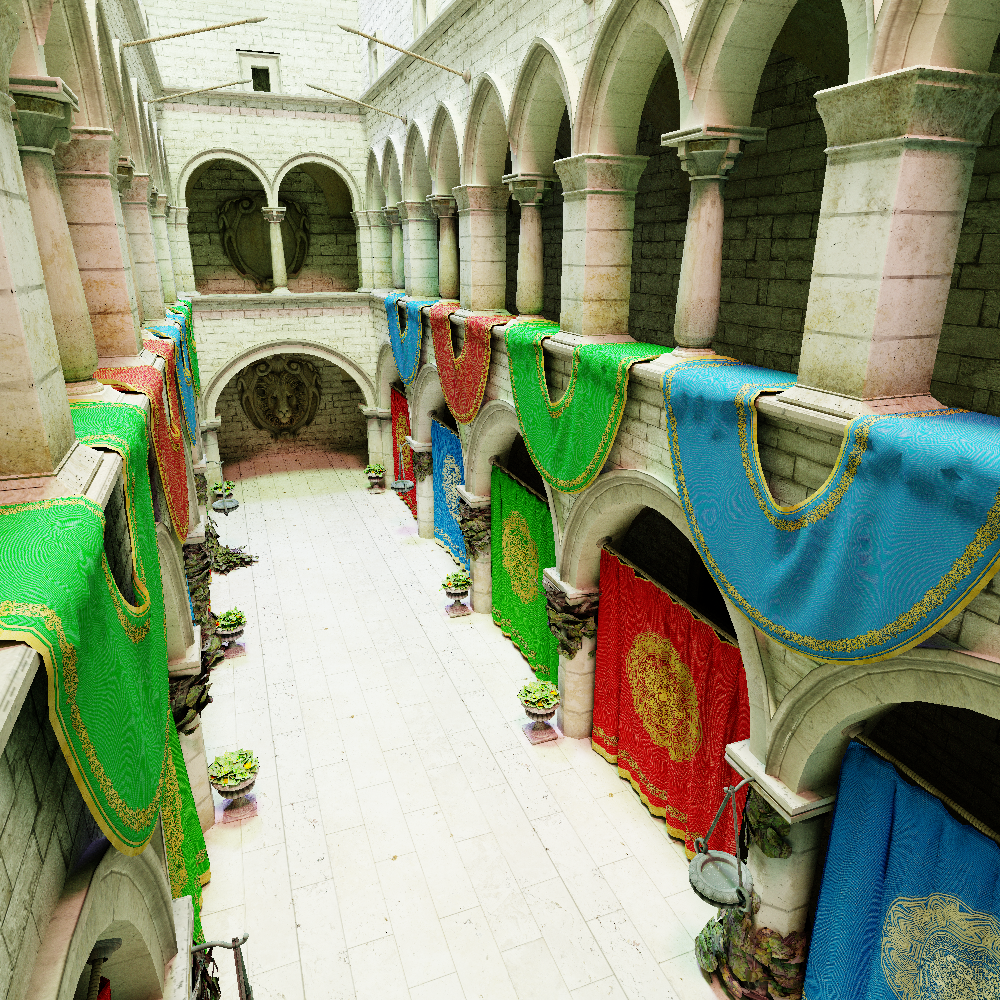

# kobra

Kobra is a 3D game engine with the purpose of providing a handful of styles of rednering and tools to ease the developement of game and interactive 3D software.

# Screenshots

# Goals

Specialized rendering styles:

- [ ] Rasterization
- [x] Simple (and fast) ray-tracing
- [ ] Path tracing
- [ ] Non-photorealistic rendering (.i.e. cross hatching)

Tools:

- [ ] 3D scene reconstruction (from a set of images)
- [ ] 3D terrain generation
